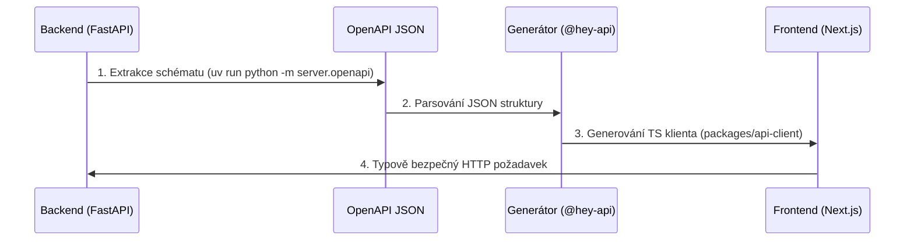

<div align="center">
  <h2>bod | API Contract & Typification</h2>
  <p><i>Knowledge Base / Technická dokumentace</i></p>
  
  [](../README.md)
</div>

---

Tento dokument definuje strategii zajištění komunikační bezpečnosti mezi klientskou a serverovou vrstvou. Architektura striktně implementuje návrhový vzor **Single Source of Truth (SSOT)** pro eliminaci integračních chyb.

## Datový tok a generování

Manuální definice TypeScript rozhraní pro HTTP komunikaci je zakázána. Zdrojovou pravdou datových modelů a parametrů koncových bodů je výhradně backendová vrstva definovaná pomocí FastAPI a Pydantic modelů.



## Integrační mechanismus

Po jakékoliv modifikaci backendových modelů nebo API rozhraní je vyžadováno provedení automatizované synchronizace:

```bash
pnpm gen:api
```

### Princip fungování automatizace
1. **Extrakce**: Inicializační skript exportuje aktuální strukturu API do formátu OpenAPI 3 a uloží ji do `docs/openapi.json`.
2. **Transpilace**: Transpilátor (`@hey-api/openapi-ts`) načte exportované schéma a vygeneruje staticky typovaný TypeScript klient obsahující komunikační funkce a datové typy.
3. **Distribuce**: Vygenerovaný kód je uložen do sdílené knihovny `packages/api-client/src`, odkud je okamžitě dostupný pro konzumaci ve vrstvě Frontend (`apps/web`).

## Pravidla vývoje API

1. **Integrita generovaného klienta**: Modifikace zdrojového kódu v adresáři `packages/api-client/src` je striktně zakázána. Jakékoliv úpravy rozhraní musí probíhat výhradně úpravou definic v jazyce Python na backendu.
2. **Pravidla verzování (VCS)**: Autogenerovaný zdrojový kód klienta není verzován v repozitáři (přítomnost v `.gitignore`), aby se předešlo redundanci při revizích kódu. Ukládání souboru `docs/openapi.json` je naopak povinné, neboť slouží jako historický kontrakt a poskytuje data pro Docker image frontendu bez nutnosti spouštět Python běhové prostředí.
3. **Standardizovaná konzumace dat**: Přímé využívání nativního API `fetch` pro dotazování interních backendových služeb je zakázáno. Klientská vrstva musí využívat výhradně vygenerované funkce, které zajišťují formální kontrolu vstupních a výstupních parametrů.

Příklad konzumace v rámci Next.js Server Komponenty:
```tsx
import { getTimetableApiV1TimetableClassIdGet } from "@bod/api-client";

// Návratová hodnota je plně typována (Lesson[])
const { data, error } = await getTimetableApiV1TimetableClassIdGet({
    baseUrl: process.env.NEXT_PUBLIC_API_BASE_URL,
    path: { class_id: 1 },
});
```
