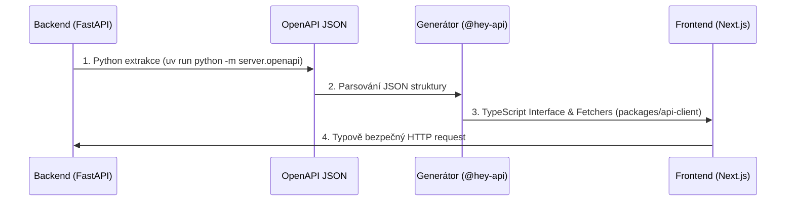

<div align="center">
  <h2>bod | API Contract & Typification</h2>
  <p><i>Knowledge Base / Technická dokumentace</i></p>
  
  [](../README.md)
</div>

---

Tento dokument vysvětluje naši "tajnou zbraň" – naprostou eliminaci bugů vznikajících špatnou komunikací mezi Frontendem a Backendem. Vše stojí na principu **Single Source of Truth (SSOT)**.

## Jak funguje náš datový tok?

Zapomeňte na ruční přepisování TypeScript interfaců z hlavy nebo z postmanu. Zdrojová pravda leží výhradně na backendu ve FastAPI a Pydantic modelech. 



## Integrační Mechanismus (Na 1 kliknutí)

Kdykoliv změníš model nebo endpoint na backendu, stačí zavolat jediný příkaz:

```bash
pnpm gen:api
```

### Co se reálně stane?
1. **Extrakce**: Python skript načte FastAPI strukturu a vyklopí ji do `docs/openapi.json`.
2. **Transpilace**: Generátor (`@hey-api/openapi-ts`) popadne tento JSON a přežvýká ho do čistého TypeScript kódu plného fetchovacích funkcí a exaktních interfaců.
3. **Distribuce**: Tenhle nový TS kód se uloží do sdíleného balíčku `packages/api-client/src`, odkud ho okamžitě vidí náš Next.js frontend.

## 3 Železná Pravidla Vývoje API

1. **Zákaz sahání na vygenerovaného klienta**: Do složky `packages/api-client/src` nikdy ručně nezasahujeme. Je to zóna generátoru. Cokoliv potřebuješ upravit, uprav na backendu v Pythonu.
2. **Ignorujeme klienta v Gitu**: Vygenerovaný kód nedává smysl verzovat (vytvářel by šum v každém PR), takže složka `packages/api-client/src` je v `.gitignore`. **Pozor:** Naopak `docs/openapi.json` se verzovat MUSÍ! Tvoří historický kontrakt a Docker frontend z něj rovnou generuje interfacové soubory, aniž by musel zapínat Python.
3. **Fetchujeme stylově**: Ve Frontendu nikdy nepíšeme hloupý raw `fetch("/api/...")`. Vždy voláme vygenerovanou funkci, která nám rovnou řekne, co bere a co vrací.

Příklad z reálného světa (v Next.js Server Komponentě):
```tsx
import { getTimetableApiV1TimetableClassIdGet } from "@bod/api-client";

// Metoda rovnou vrací plně otypované data (Lesson[])
const { data, error } = await getTimetableApiV1TimetableClassIdGet({
    baseUrl: process.env.NEXT_PUBLIC_API_BASE_URL,
    path: { class_id: 1 },
});
```
