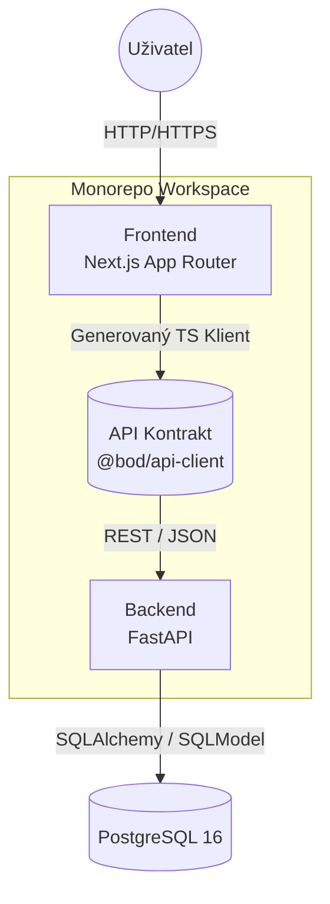
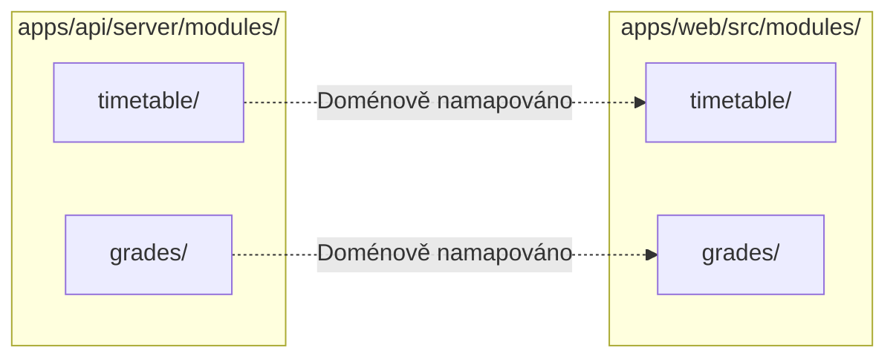

  <h2>bod | System Architecture</h2>
  
<i>Knowledge Base / Technická dokumentace</i>

  
  

---

Architektura `bod` kašle na tradiční špagetový kód. Jedeme striktní Domain-Driven Design (Feature-Driven), 100% End-to-End typovou bezpečnost a naprostou symetrii mezi tím, co běží v prohlížeči, a tím, co sedí na serveru.

## Jak spolu věci mluví?

Komunikace běží přes klasické REST API. Rozdíl je v tom, že Frontend nikdy netipuje, jaká data z Backend API přijdou. Vše se automaticky generuje z OpenAPI specifikace přímo do TypeScript klienta.

## Moduly, ne vrstvy

Zapomeňte na gigantické složky `routes/`, `models/` a `controllers/`. Kód dělíme výhradně podle byznys domén (např. *Timetable*, *Grades*). Pokud přidáváš funkci do rozvrhu, sáhneš do jediné složky.

### Striktní Frontend/Backend Symetrie

Každá byznys doména má svou složku na Backend u (FastAPI) i na Frontendu (Next.js). Pokud backend pošle data z modulu `timetable`, frontend je chytá a renderuje v odpovídajícím modulu `timetable`. Žádný zmatek.

- **Backend modul** řeší databázi (SQLModel), byznys logiku a API endpointy (FastAPI).
- **Frontend modul** konzumuje vygenerovaného klienta a stará se o UI (React Server/Client komponenty).

## Auto-Init Databáze (No Migrations)

Jsme malý tým. Nechceme ztrácet čas řešením zničených migračních skriptů z Alembicu. Databáze se u nás aktualizuje sama přes **Auto-Init (Lifespan)**.

1. Při startu Uvicorn serveru se spustí FastAPI `lifespan` hook.
2. Aplikace si osahá modely (`SQLModel`) a zkontroluje PostgreSQL.
3. Zavolá se `SQLModel.metadata.create_all()`. Nové tabulky se založí, chybějící sloupečky se vytvoří.

Díky tomu můžeš beztrestně iterovat nad Python modely, stačí jen restartovat server!
