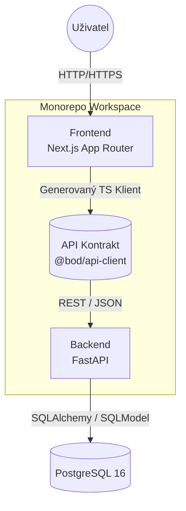
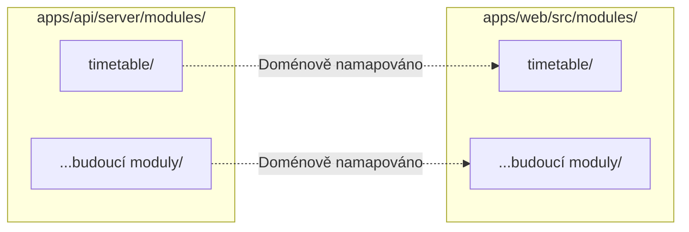

  <h2>bod | System Architecture</h2>
  
<i>Knowledge Base / Technická dokumentace</i>

  
  

---

Architektura systému `bod` je navržena s důrazem na oddělení logických celků pomocí metodiky Domain-Driven Design (Feature-Driven). Systém implementuje 100% End-to-End typovou bezpečnost a zachovává strukturální symetrii mezi klientskou (prohlížeč) a serverovou vrstvou.

## Architektura komunikace

Komunikace mezi Frontend a Backend vrstvou je realizována přes standardní REST API. Klientská aplikace nespravuje ručně definice datových typů pro přijímaná data; namísto toho jsou veškeré transportní objekty (DTO) a komunikační funkce plně generovány z OpenAPI specifikace přímo do TypeScript klienta.

## Doménově orientované moduly

Systém nevyužívá horizontální vrstvení architektury (oddělené složky pro `routes/`, `models/`, `controllers/`). Zdrojový kód je dělen výhradně podle byznys domén (např. *Timetable*, *Grades*). Veškerá logika patřící do konkrétní domény je zapouzdřena v jednom dedikovaném adresáři.

### Striktní Frontend/Backend Symetrie

Každá byznys doména má definovaný svůj vlastní adresář jak na úrovni Backend vrstvy (FastAPI), tak na úrovni Frontend vrstvy (Next.js). Data pocházející z backendového modulu `timetable` jsou zpracovávána a vizualizována odpovídajícím klientským modulem `timetable`. V průběhu vývoje budou přibývat další moduly (např. pro správu uživatelů nebo klasifikaci) — každý bude přidán symetricky na obě vrstvy.

- **Backend modul** spravuje databázové struktury (SQLModel), byznys logiku a definice API koncových bodů (FastAPI).
- **Frontend modul** konzumuje služby generovaného klienta a implementuje uživatelské rozhraní prostřednictvím React Server a Client komponent.

## Auto-Init Databáze (Bez migrací)

Pro zefektivnění vývojového cyklu a eliminaci rizik spojených s asynchronními migračními skripty využívá systém mechanismus **Auto-Init (Lifespan)** pro inicializaci databáze.

1. Při spuštění ASGI serveru (Uvicorn) se aktivuje `lifespan` hook frameworku FastAPI.
2. Aplikace načte všechny registrované entity (`SQLModel`) a ověří existenci struktury v PostgreSQL.
3. Prostřednictvím metody `SQLModel.metadata.create_all()` jsou programaticky vytvořeny chybějící tabulky a sloupce.

Tento přístup umožňuje provádět iterativní změny databázových modelů v Pythonu bez nutnosti manuální správy migrací; postačuje standardní restart aplikace.
